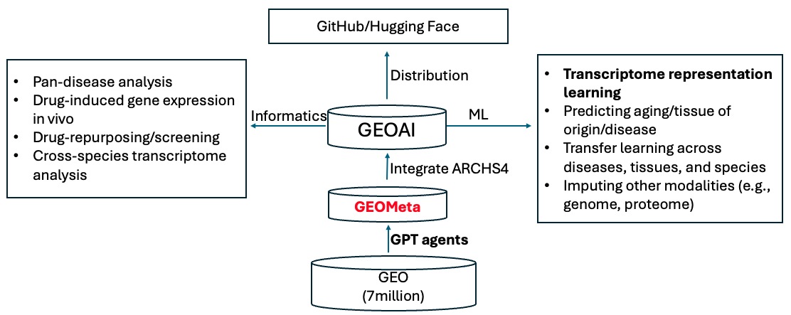
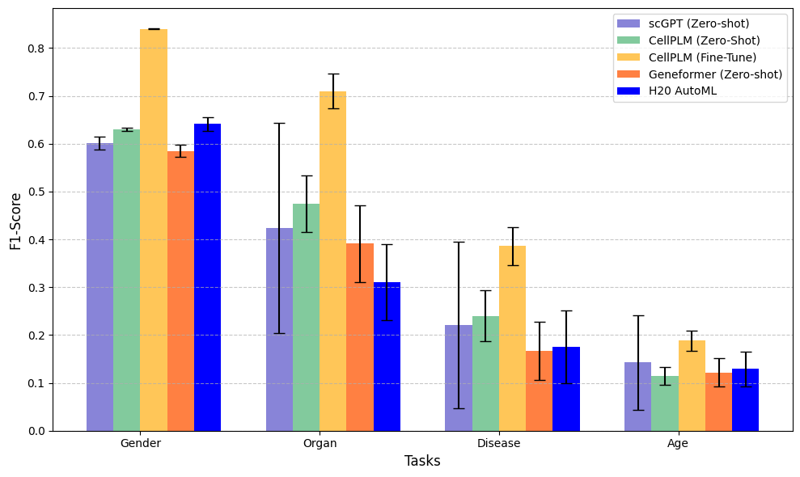
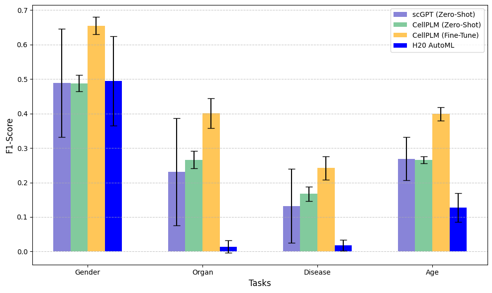

# **GEOmeta: Massive Labeled Transcriptomics Dataset**
This GitHub repository of GEO_GPT introduces "GEOmeta" from "Massive Labeled Transcriptomics as a Resource of Transcriptome Representation Learning". 
It is designed for building and querying GEO_Metadata to facilitate large-scale transcriptomics research and machine learning applications in biomedicine.
This project was developed by researchers at Michigan State University.
 
## **Repository Features or Resources**
This dataset includes:

- **100,000 human samples metadata**
- **100,000 mouse samples metadata**
- **Prompts:**
  - **Annotation prompts** to process raw metadata
  - **Standardization prompts** to generate machine-readable labels
- **Label Prediction Code**

  ## **Data Availability**
- [Human Metadata](benchmark/data/ANNOTATED_METADATA_HUMANSAMPLES.xlsx)
- [Mouse Metadata](benchmark/data/ANNOTATED_METADATA_HUMANSAMPLES.xlsx)
- [Benchmark data](benchmark/data/GEOMeta100K)
- [Prompts](curation)
-  **Code for label prediction** based on gene expression profiles is available in the [Labeling_code](benchmark/code) folder.

## **Metadata Structure**
The following table describes the columns available in the dataset:

| **FIELD**                  | **DETAIL**                                                                 | **USE** |
|----------------------------|---------------------------------------------------------------------------|---------|
| **GSM_ID**                 | The GSM_ID is the unique identifier for each sample within the GEO database. | Ensures that annotations are traceable to their corresponding samples, allowing researchers to pinpoint specific data for verification. |
| **GSE_ID**                 | The GSE_ID represents the experiment to which individual samples (GSM_IDs) belong. | Links samples to their experiment, helping researchers understand the broader study context and analyze dataset patterns. |
| **Organism**               | Captures the species or organism from which the sample is derived, using standardized scientific names. | Facilitates cross-study comparisons and dataset integration. For example, distinguishing between *Mus musculus* (Mouse) and *Homo sapiens* (Human) aids in differentiating animal models from human studies. |
|**Strain (Mouse) and Race/Ethnicity (Human)** | Specifies the detailed strain names for mice or race/ethnicity classifications for human samples, including indications of mixed populations. | Essential for understanding genetic diversity and its impact on experimental outcomes. For instance, studies using C57BL/6J mice may produce different results compared to those using a mixed strain, highlighting the importance of genetic background in research interpretation. |
| **Genotype**               | Details specific genetic modifications, such as knockouts, knockdowns, overexpression, or mutations. | Essential for linking genetic variations to observed phenotypes, enabling targeted analyses such as examining the role of a knockout gene in disease progression. |
| **Experimental Settings**  | Describes the conditions (In vivo, Ex vivo, In Vitro under which the sample was treated or maintained during the experiment. | Ensures reproducibility and helps control for confounding factors when comparing results across samples or studies. |
| **Model (Mouse)**     | Specifies the experimental model used, including gene knock-in, gene knock-out, drug-induced disease models, and patient-derived induced pluripotent stem cells (iPSCs). | Helps researchers distinguish between different genetic and pharmacological modifications used in mouse models for studying disease mechanisms and therapeutic responses. |
| **Specimen Type (Human)** | Describes the type of human sample, such as primary tissue, cell line, isolated cells , PDX or organoid. | Enables precise categorization of human samples, ensuring proper context for gene expression analysis and cross-study comparisons. |
| **RNA Source**  | Specifies the biological origin of the extracted RNA, such as blood, tissue, or cultured cells. | Essential for understanding the sample context, as gene expression profiles can vary significantly depending on the RNA source. |
| **Organ**       | Identifies the specific organ or tissue from which the sample was derived. | Crucial for linking gene expression patterns to specific physiological functions, diseases, and experimental conditions. |
| **Disease**                | Identifies any disease associated with the GSM sample. | Vital for researchers studying disease mechanisms. |
| **Age and Age Group**                    | Records the age of the organism or sample at the time of collection. | Crucial for studies in developmental biology or aging research. Precise age annotations allow for temporal analyses and better result stratification. |
| **Gender**                 | The biological sex (e.g., male, female) of the organism or donor from which the sample was derived. | Gender is a critical factor in biological and medical studies, influencing physiological and pathological processes such as disease prevalence, progression patterns, and drug response variations. |
| **Perturbation Details (e.g., Name, Type,Dose, Frequency, Duration, Route)** | Provides specific information about any perturbation applied to the sample. | Helps researchers assess dose-response relationships, therapeutic efficacy, and treatment-specific outcomes. For example, knowing the dose and route of a drug allows for comparisons across pharmacological studies. |
| **Timepoint (Human)**   | Indicates the time at which the sample was collected relative to an experimental treatment or biological process. | Helps in tracking dynamic changes in gene expression over time, enabling studies on disease progression, treatment response, or developmental stages. |
| **Outcome (Human)**     | Describes the observed experimental or clinical results associated with the sample, such as disease progression, treatment response, or survival status. | Provides valuable insights for predictive modeling and biomarker discovery, helping to assess correlations between gene expression and phenotypic outcomes. |

## **Transcriptome Representation Learning Benchmarks**
The goal is to predict the labels of disease/organ/sex/age from learned transcriptome. The following table describes the number of unique labels in each field. 
|   Dataset          | GSE  | GSM   | Sex | Organ* | Disease | Age group |
|--------------|------|-------|-----|-------|---------|-----------|
| Human training | 1858 | 92122 | 2   | 39    | 129     | 13        |
| Human test    | 206  | 7892  | 2   | 30    | 79      | 13        |
| Mouse training | 4743 | 90654 | 3   | 210   | 125     | 9         |
| Mouse test    | 527  | 9425  | 3   | 130   | 71      | 9         |

*Mouse organs have a more granular classification.

**Leaderboard for human samples (F1 score)**
|                          | Gender        | Organ         | Disease       | Age           |
|--------------------------|--------------|--------------|--------------|--------------|
| scGPT (zero-shot)       | 0.601 ± 0.019 | 0.424 ± 0.310 | 0.221 ± 0.247 | 0.143 ± 0.140 |
| CellPLM (zero-shot)     | 0.630 ± 0.017 | 0.474 ± 0.319 | 0.240 ± 0.289 | 0.114 ± 0.100 |
| CellPLM (finetune)      | **0.840 ± 0.012** | **0.710 ± 0.329** | **0.386 ± 0.364** | **0.188 ± 0.189** |
| Geneformer (zero-shot)  | 0.585 ± 0.045 | 0.391 ± 0.276 | 0.167 ± 0.209 | 0.122 ± 0.100 |
| H20_AutoML              | 0.641 ± 0.051 | 0.31 ± 0.276 | 0.176 ± 0.263 | 0.129 ± 0.124 |

 

**Leaderboard for mouse samples (F1 score)**
|                          | Gender        | Organ         | Disease       | Age           |
|--------------------------|--------------|--------------|--------------|--------------|
| scGPT (zero-shot)       | 0.489 ± 0.272 | 0.231 ± 0.269 | 0.132 ± 0.186 | 0.269 ± 0.108 |
| CellPLM (zero-shot)     | 0.488 ± 0.283 | 0.266 ± 0.305 | 0.167 ± 0.242 | 0.266 ± 0.117 |
| CellPLM (finetune)      | **0.655 ± 0.221** | **0.401 ± 0.374** | **0.242 ± 0.288** | **0.399 ± 0.167** |
| H20_AutoML              | 0.495 ± 0.367 | 0.014 ± 0.05 | 0.018 ± 0.045 | 0.127 ± 0.119 |

 

## **Citation**
If you find our work helpful in your research, we would greatly appreciate your citation :

Paithankar, S.*, Zhang, X.*, & Murtaza, S.*, Pu, J., Shankar, R., Leshchiner, D., Tang, J., Dai, X., Xie, Y., Li, X., & Chen, B. (2025). Massive labeled transcriptomics as a resource of transcriptome representation learning. Michigan State University, Grand Rapids, MI, USA.

